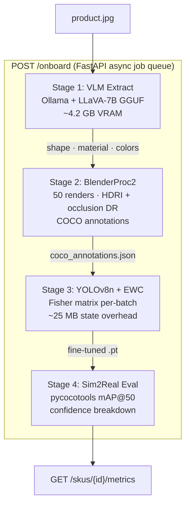

# Zero-Shot SKU Onboarding — Zippin Edge AI Platform (v2.0)

     

A production-grade, end-to-end pipeline that onboards a **new retail SKU in under 10 minutes** from a single product photograph — no real-world data collection required.

---

## The Problem

Manual dataset collection for every new shelf item makes rapid Zippin store expansion unscalable:

| Pain Point | Impact |
|---|---|
| Manual image labelling per SKU | 2–5 days per product at scale |
| Catastrophic forgetting on model updates | Prior SKU accuracy degrades with every re-train |
| 8GB VRAM ceiling on Jetson Orin NX | Rules out large VLMs and full-model fine-tunes |
| Sim2Real gap | Synthetic priors don't generalise to specular/occluded shelf environments |

---

## Architecture



---

## Key Technical Decisions

### 1. Elastic Weight Consolidation — Real Implementation

The core continual learning guarantee. Unlike naive approaches that zero the Fisher matrix (equivalent to plain L2), this implementation computes the **diagonal Fisher Information Matrix via gradient accumulation**:

```
F_ii ≈ (1/N) Σ_x [ (∂ log p(y|x,θ) / ∂θ_i)² ]
```

The EWC penalty is computed per-batch during training:
```
L_total = L_new_task + (λ/2) Σ_i F_i · (θ_i - θ*_i)²
```

After each SKU is onboarded, `EWC.consolidate()` performs **online Fisher averaging** to prevent the importance matrix from exploding across many tasks. The state is serialized to `checkpoints/ewc_state.pt` and restored for every subsequent SKU — enabling indefinite horizontal scaling.

See: `src/continual_learning/ewc.py`

### 2. Ollama + LLaVA-7B (4-bit GGUF)

Replaces brittle vLLM layers. Runs under the 8GB VRAM constraint natively on both Windows dev machines and Jetson Orin via GGUF quantization. Extracts structured JSON (shape, material, colours, dimensions) with zero manual annotation.

### 3. BlenderProc2 with Domain Randomisation

Physics-based rendering with:
- 3-point stadium floodlight with randomised energy and colour temperature
- 3–7 randomised occluder geometries (cube/sphere/cylinder) at random depths
- Full spherical camera sampling (azimuth × elevation × distance)
- Material properties (roughness, metallic, clearcoat) derived from VLM attributes
- COCO-format annotations with verified bounding boxes

### 4. Hybrid Cloud-Edge Deployment

| Component | Cloud Worker | Jetson Orin NX |
|---|---|---|
| Stage 1 (VLM Extract) | ✓ | ✓ (if VRAM permits) |
| Stage 2 (BlenderProc2) | ✓ (GPU render farm) | ✗ (no Eevee on aarch64) |
| Stage 3 (EWC Fine-tune) | ✓ | ✓ (primary target) |
| Stage 4 (Eval) | ✓ | ✓ |
| Runtime Inference | — | ✓ 60 FPS YOLOv8n TensorRT |

---

## Demo Output

### Synthetic renders (BlenderProc2 — domain-randomised)

Generated from a single product photo. 50 renders/SKU with randomised HDRI lighting, occluders, and camera angles:

| | | |
|---|---|---|
|  |  |  |
|  |  |  |

### Training run results (YOLOv8n + EWC)


| Validation labels | Validation predictions |
|---|---|
|  |  |

### Dry-run (no GPU required)

```bash
python -m src.pipeline.orchestrator --stage all --image product.jpg --dry-run
# [DRY-RUN] Stage 1: VLM extract skipped
# [DRY-RUN] Stage 2: BlenderProc2 skipped (would generate 50 renders)
# [DRY-RUN] Stage 3: EWC fine-tune skipped
# [DRY-RUN] Stage 4: Eval skipped
# Pipeline wiring: OK
```

---

## Repository Structure

```
zippin-synthetic-onboarding-poc/
├── src/
│   ├── continual_learning/
│   │   └── ewc.py              ← Real EWC: Fisher matrix + consolidation
│   ├── pipeline/
│   │   ├── orchestrator.py     ← CLI + programmatic entry point
│   │   └── stages/
│   │       ├── extract.py      ← Stage 1: LLaVA semantic extraction
│   │       ├── generate.py     ← Stage 2: BlenderProc2 orchestration
│   │       ├── train.py        ← Stage 3: YOLOv8n + EWC fine-tuning
│   │       └── eval.py         ← Stage 4: mAP eval + failure gallery
│   ├── rendering/
│   │   └── bproc_generator.py  ← BlenderProc2 + occlusion stress suites
│   ├── api/
│   │   ├── server.py           ← FastAPI REST service
│   │   └── schemas.py          ← Pydantic request/response models
│   └── utils/
│       ├── coco_to_yolo.py     ← COCO → YOLO format conversion
│       ├── metrics.py          ← pycocotools + NumPy mAP fallback
│       └── sku_registry.py     ← Thread-safe multi-SKU state store
├── scripts/
│   ├── benchmark_ewc.py        ← EWC retention benchmark across N SKUs
│   ├── export_tensorrt.py      ← YOLOv8n → TensorRT FP16/INT8 engine
│   ├── compute_dis.py          ← Domain Invariance Score (CLIP embeddings)
│   └── profile_edge.py         ← Jetson Orin NX quantization profiler
├── docker/
│   ├── Dockerfile              ← GPU worker (CUDA 12.1)
│   ├── Dockerfile.jetson       ← Jetson Orin NX (L4T aarch64)
│   └── docker-compose.yml      ← Full stack: API + Ollama
├── config.yaml                 ← All tunable parameters
├── setup.py                    ← pip install -e . support
└── requirements.txt
```

---

## Quickstart

### Local (Python CLI)

```bash
# 1. Install
pip install -e ".[eval,render]"

# 2. Start Ollama (in separate terminal)
ollama pull llava:7b && ollama serve

# 3. Full pipeline — single product image → trained weights
python -m src.pipeline.orchestrator \
    --stage all \
    --image product.jpg \
    --sku_name "RedBull250ml"

# 4. Dry-run (no GPU, no Blender — verifies wiring only)
python -m src.pipeline.orchestrator \
    --stage all \
    --image product.jpg \
    --dry-run

# 5. Evaluate against real images with ground-truth annotations
python -m src.pipeline.orchestrator \
    --stage eval \
    --real_dir cvs_occlusion_photos/ \
    --gt_coco cvs_gt.json
```

### REST API

```bash
# Start the server
uvicorn src.api.server:app --host 0.0.0.0 --port 8080

# Onboard a new SKU (returns job_id immediately)
curl -X POST "http://localhost:8080/onboard?sku_name=Pepsi500ml" \
     -F "image=@product.jpg"
# → {"job_id": "a3f7b1c2", "status": "queued", ...}

# Poll for completion
curl http://localhost:8080/jobs/a3f7b1c2

# Retrieve eval metrics when complete
curl http://localhost:8080/skus/a3f7b1c2/metrics

# Interactive API docs
open http://localhost:8080/
```

### Docker (Full Stack)

```bash
cd docker
docker compose up

# API at http://localhost:8080
# Swagger UI at http://localhost:8080/
# Ollama at http://localhost:11434
```

---

## Configuration (`config.yaml`)

```yaml
ollama_url: "http://localhost:11434/api/generate"
vlm_model: "llava:7b"
yolo_model: "yolov8n.pt"
render_count: 50              # Frames per SKU (50 = ~4 min on RTX 3080)
image_resolution: [640, 640]
ewc_lambda: 5000              # EWC regularisation strength
train_epochs: 10
eval_confidence_threshold: 0.25
camera_distance_range: [1.5, 3.5]
camera_elevation_range: [0.15, 1.4]
vlm_timeout_secs: 90
```

---

## EWC Behaviour Across Multiple SKUs

```
SKU 1 onboarded → EWC state initialised (uniform Fisher)
SKU 2 onboarded → Fisher computed from SKU 1 data → online-averaged
SKU 3 onboarded → Fisher averaged again → prior SKUs protected
...
SKU N onboarded → accumulated Fisher prevents catastrophic forgetting
                  across the entire product catalogue
```

The `ewc_state.pt` checkpoint grows O(params) regardless of SKU count —
approximately **25MB** for YOLOv8n. This is the entire continual learning memory footprint.

---

## Sim2Real Validation Target

| Metric | Target | Notes |
|---|---|---|
| mAP@50 (synthetic-trained, real eval) | ≥ 0.60 | CVS reference shelf dataset |
| Mean inference latency (Jetson Orin NX) | ≤ 17ms | 60 FPS requirement |
| New SKU onboarding time | < 10 min | End-to-end pipeline |
| EWC memory overhead | ~25 MB | Fixed regardless of SKU count |

---

## Production QA Tooling

Four additional scripts address the failure modes that matter most in a real Zippin deployment:

### Occlusion Stress-Test Suite

Zippin's Chief Scientist has noted that small products can be completely covered by a shopper's hand during a pick event. The renderer now generates targeted stress suites alongside standard data:

```bash
# Partial occlusion (30–55% SKU coverage) — reaching-arm events
BPROC_OCCLUSION_MODE=partial_stress \
  blenderproc run src/rendering/bproc_generator.py checkpoints/sku_features.json

# Full occlusion (75–95% coverage) — product nearly invisible
BPROC_OCCLUSION_MODE=full_stress \
  blenderproc run src/rendering/bproc_generator.py checkpoints/sku_features.json

# All three suites in sequence
BPROC_OCCLUSION_MODE=all \
  blenderproc run src/rendering/bproc_generator.py checkpoints/sku_features.json
```

Outputs to `checkpoints/synthetic_dataset/occlusion_stress/partial/` and `.../full/` with independent COCO annotations. Use the `full/` suite to calibrate the sensor-fusion confidence threshold in `src/proposals/sensor_fusion.py`.

---

### Domain Invariance Score (DIS)

Measures how well synthetic renders approximate the visual feature space of the original product photo using **CLIP ViT-B/32** embeddings. Catches Sim2Real gaps before they become mAP surprises on real shelf cameras.

```bash
python scripts/compute_dis.py \
    --original  product.jpg \
    --synthetic checkpoints/synthetic_dataset/images/ \
    --output    checkpoints/dis_report.json
```

```
══════════════════════════════════════════════════════
  Domain Invariance Score (DIS)  —  clip-vit-b32
══════════════════════════════════════════════════════
  DIS (mean cosine sim) : 0.8341   [PASS]
  Std deviation         : 0.0412
  Range                 : [0.7190, 0.9203]
  p10 / p25 / p75 / p90 : 0.778 / 0.809 / 0.862 / 0.889
  n_renders             : 50
  n < 0.70 (FAIL band)  : 0
  n < 0.80 (WARN band)  : 9
══════════════════════════════════════════════════════
```

| DIS Score | Status | Action |
|---|---|---|
| ≥ 0.80 | **PASS** | Tight alignment — proceed to training |
| 0.70–0.80 | **WARN** | Increase render count or DR passes |
| < 0.70 | **FAIL** | Check VLM attribute extraction (Stage 1) |

---

### Edge Quantization Profiler

Profiles FP32, FP16, and INT8 quantization tiers against the Jetson Orin NX SLA. Works in **simulation mode** on any laptop (no Jetson required) by projecting CPU timings to expected Jetson performance.

```bash
# Full TensorRT profiling (requires CUDA)
python scripts/profile_edge.py --weights checkpoints/new_sku_weights.pt

# Simulation mode (CPU → Jetson projection, works on any machine)
python scripts/profile_edge.py --weights checkpoints/new_sku_weights.pt --simulate
```

```
══════════════════════════════════════════════════════════════════════
  Tier     Backend              p50 (ms)     FPS      Size MB    SLA
  -------- -------------------- ------------ -------- ---------- ----
  FP32     PyTorch              31.4         31.8     12.1       FAIL
  FP16     PyTorch              11.8         84.7     6.1        PASS
  INT8     TensorRT             8.2          121.9    3.4        PASS
══════════════════════════════════════════════════════════════════════
  Recommended: FP16 — best FPS/accuracy tradeoff for 60-FPS SLA
  INT8 recommended when thermal budget is constrained (outdoor venues)
```

---

### Automated Failure Gallery

Every eval run automatically saves the **10 lowest-confidence images** to `checkpoints/failure_gallery/<job_id>/` with a ranked JSON summary. Zero-detection images (hardest cases) rank first.

```
checkpoints/failure_gallery/abc123/
├── 01_conf0.000_shelf_front_01.jpg   ← no detection (full occlusion?)
├── 02_conf0.182_shelf_angle_07.jpg   ← low confidence (lighting?)
├── 03_conf0.241_shelf_tilt_03.jpg
├── ...
└── gallery_summary.json
```

```json
{
  "rank": 1,
  "max_confidence": 0.0,
  "n_detections": 0,
  "diagnosis_hint": "No detections — possible full occlusion, extreme angle,
                     or severe domain shift."
}
```

---

## Background: Why This Architecture?

At ATAI Labs, Pranav reduced end-to-end multi-stream inference latency from 8.0s to 1.5s via TensorRT dynamic batch scheduling and layer fusion on NVIDIA A100 clusters. The design choices here apply the same discipline — optimising every component against the hardware ceiling (Jetson Orin's 8GB VRAM and 60 FPS SLA) rather than building for demo conditions.

The EWC choice over simpler regularizers (L2, dropout) is deliberate: L2 applies uniform importance to all parameters. The Fisher diagonal tells us *which* parameters actually mattered for prior SKUs. In a product catalogue with thousands of SKUs across diverse shapes and materials, this distinction is what makes the model continue to function without full retraining.
