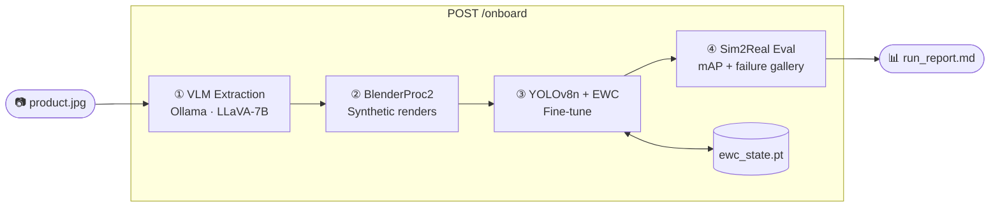

# Zero-Shot SKU Onboarding — Zippin Edge AI Platform


## What This Demonstrates

- **Single-image SKU onboarding pipeline** — VLM attribute extraction → BlenderProc2 synthetic renders → YOLOv8n fine-tune → Sim2Real evaluation
- **Sequential onboarding with EWC** — Elastic Weight Consolidation preserves prior-SKU detection performance across sequential onboarding steps (see [Continual Learning Results](#continual-learning-results))
- **Reproducible per-run artifacts** — every run produces a self-contained folder with report, renders, weights, and failure gallery

---

## Quickstart

**Dry-run (no GPU, no Blender required — verifies wiring):**
```bash
pip install -e .
python -m src.pipeline.orchestrator \
  --stage all --image product.jpg \
  --sku_name "RedBull250ml" --dry-run
```
Output: `checkpoints/local/run_report.md`

**Full GPU-backed run:**
```bash
python -m src.pipeline.orchestrator \
  --stage all --image product.jpg \
  --sku_name "RedBull250ml"
```
Requires: Ollama + LLaVA-7B running locally, BlenderProc2 installed.

**TripoSR reconstructed mesh (optional, requires 6+ GB VRAM):**
```bash
pip install tsr rembg
python -m src.pipeline.orchestrator \
  --stage all --image product.jpg \
  --sku_name "RedBull250ml" --config config_reconstructed.yaml
```

---

## Artifact Layout

Every run produces this folder structure:

```
checkpoints/<run_id>/
├── run_report.md          — human-readable summary with eval mode label
├── run_report.json        — machine-readable (API consumers)
├── renders/               — 6 deterministically-selected synthetic renders
│   ├── render_001.jpg
│   └── ...
├── coco_annotations.json  — Stage 2 COCO output
├── <run_id>_weights.pt    — fine-tuned YOLOv8n weights
├── ewc_state_snapshot.pt  — EWC Fisher matrix snapshot after this run
├── <run_id>_metrics.json  — eval metrics with eval_mode label
└── failure_gallery/       — 10 lowest-confidence real images (if eval ran)
    └── gallery_summary.json
```

---

## Continual Learning Results

> Results pending benchmark run. See [Track 2 implementation tasks](docs/superpowers/plans/2026-04-23-showcase-implementation.md).

**Claim:** Under sequential synthetic SKU onboarding, EWC preserves prior-SKU validation mAP better than naive fine-tuning.

*Retention measured on held-out synthetic validation renders with ground-truth labels generated by BlenderProc2. Real shelf-image generalization requires labeled shelf photos — see Roadmap.*

---

## Architecture


```mermaid
flowchart LR
    IMG(["📷 product.jpg"])
    subgraph PIPELINE ["POST /onboard"]
        S1["① VLM Extraction\nOllama · LLaVA-7B"]
        S2["② BlenderProc2\nSynthetic renders"]
        S3["③ YOLOv8n + EWC\nFine-tune"]
        S4["④ Sim2Real Eval\nmAP + failure gallery"]
        EWC[("ewc_state.pt")]
    end
    OUT(["📊 run_report.md"])
    IMG --> S1 --> S2 --> S3 --> S4 --> OUT
    S3 <--> EWC
```

---

## Setup

```bash
pip install -r requirements.txt
```

**Procedural mode (default):** No additional dependencies beyond the above.

**Reconstructed mode (optional):**
```bash
pip install tsr rembg          # TripoSR + background removal
# Requires GPU with 6+ GB VRAM free. Tested on RTX 5070 (8 GB) at mesh_resolution=256.
```

**Ollama (for Stage 1 VLM extraction):**
```bash
# Install Ollama: https://ollama.com
ollama pull llava:7b
```

---

## Evaluation Semantics

Runs report one of three eval modes:

| Mode | Meaning |
|---|---|
| `real_map` | Ground-truth mAP via pycocotools. Requires `--gt_coco <path>`. |
| `proxy_only` | Confidence-based proxy. No GT labels. Directional only. |
| `skipped` | No real images provided. Pass `--real_dir` to enable. |

The mode is labeled in `run_report.md` and `run_report.json`.

---

## Roadmap

- Labeled real shelf images for Sim2Real mAP validation
- TripoSR reconstructed mesh quality benchmark
- TensorRT FP16/INT8 export and Jetson Orin NX profiling
- Occlusion stress-test suite
