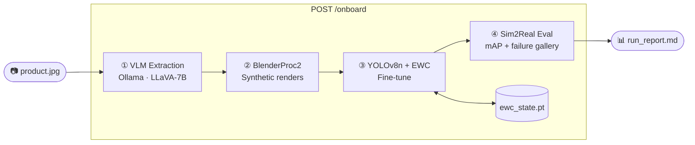

# Showcase Implementation Plan

> **For agentic workers:** REQUIRED SUB-SKILL: Use superpowers:subagent-driven-development (recommended) or superpowers:executing-plans to implement this plan task-by-task. Steps use checkbox (`- [ ]`) syntax for tracking.

**Goal:** Convert the existing PoC into a provable showcase with standardized run artifacts (Track 1) and a validated EWC retention benchmark (Track 2).

**Architecture:** Two parallel tracks that converge in the README. Track 1 makes every run folder self-describing; Track 2 adds a 3-SKU EWC vs naive benchmark. No pipeline restructuring — all changes are additive or targeted surgical edits.

**Tech Stack:** Python 3.10+, FastAPI, YOLOv8n (ultralytics), pycocotools, BlenderProc2, matplotlib, pytest, pydantic

---

## File Map

| Status | Path | Responsibility |
|---|---|---|
| **Modify** | `config.yaml` | Switch mesh_source to procedural |
| **Create** | `config_reconstructed.yaml` | TripoSR config with explicit env requirements |
| **Modify** | `src/pipeline/stages/eval.py` | Add `eval_mode`, restructure early exits, fix gallery path |
| **Modify** | `src/pipeline/stages/train.py` | Snapshot ewc_state.pt to run folder |
| **Modify** | `src/pipeline/stages/generate.py` | Add deterministic train/val split (Task 10) |
| **Modify** | `src/pipeline/reporting.py` | Add thumbnails + eval_mode label |
| **Modify** | `src/api/schemas.py` | Add `eval_mode` field to EvalResult |
| **Create** | `tests/test_pipeline_smoke.py` | 4 smoke tests for dry-run/eval/report |
| **Create** | `tests/test_api_lifecycle.py` | API contract test (monkeypatched pipeline) |
| **Modify** | `README.md` | Honest rewrite: quickstart, artifact layout, remove unproven claims |
| **Create** | `skus/` | Directory for 3 reference product images |
| **Create** | `scripts/_benchmark_eval.py` | Evaluate YOLO weights on a COCO val split |
| **Create** | `scripts/benchmark_ewc.py` | Run EWC vs naive 3-SKU benchmark |
| **Create** | `docs/benchmark_results/` | Output dir for CSV + plots |

---

## Task 1: Switch default config to procedural + create config_reconstructed.yaml

**Files:**
- Modify: `config.yaml:20`
- Create: `config_reconstructed.yaml`

- [ ] **Step 1: Edit config.yaml**

Change line 20 from `mesh_source: "reconstructed"` to `mesh_source: "procedural"`.
Change line 27 from `mesh_backend: "hf_space"` to `mesh_backend: "triposr_local"` (so if someone opts in to reconstructed, they get the local path, not the rate-limited HF Space).

The section should read:
```yaml
mesh_source: "procedural"
mesh_backend: "triposr_local"
```

- [ ] **Step 2: Create config_reconstructed.yaml**

```yaml
# TripoSR-backed mesh reconstruction config.
#
# Requirements:
#   pip install tsr rembg
#   GPU with 6+ GB VRAM free (TripoSR uses ~5 GB at mesh_resolution=256)
#   Tested on RTX 5070 (8 GB VRAM) at mesh_resolution=256.
#
# NOT the default. Use config.yaml (procedural) for first-run demos and CI.
# Pass via: --config config_reconstructed.yaml

ollama_url: "http://localhost:11434/api/generate"
vlm_model: "llava:7b"
yolo_model: "yolov8n.pt"
render_count: 300
image_resolution: [640, 640]
train_epochs: 50
train_batch: 8
train_workers: 0
ewc_lambda: 5000
camera_distance_range: [1.5, 3.0]
camera_elevation_range: [0.1, 1.5]
val_fraction: 0.2

mesh_source: "reconstructed"
mesh_backend: "triposr_local"
mesh_resolution: 256
mesh_vram_budget_gb: 6.0
critic_max_retries: 2
```

- [ ] **Step 3: Verify dry-run still works**

```bash
python -m src.pipeline.orchestrator --stage all --image product.jpg --sku_name "TestSKU" --dry-run
```

Expected: pipeline completes, `checkpoints/local/run_report.md` exists. No TripoSR import errors.

- [ ] **Step 4: Commit**

```bash
git add config.yaml config_reconstructed.yaml
git commit -m "config: default to procedural mesh; triposr config is explicit opt-in"
```

---

## Task 2: Add eval_mode to stage_eval + restructure early exits

**Files:**
- Modify: `src/pipeline/stages/eval.py`

The current function imports `ultralytics` before checking whether `real_images_dir` exists. This makes it impossible to test the "skipped" path without ultralytics installed. Restructure to check early exits first, then import.

- [ ] **Step 1: Replace the top of stage_eval**

Open `src/pipeline/stages/eval.py`. Replace the `stage_eval` function body from the dry_run check through the image_files check. The new structure:

```python
def stage_eval(
    real_images_dir: str,
    weights_path: str,
    config: dict,
    checkpoint_dir: str = "checkpoints",
    coco_gt_path: Optional[str] = None,
    dry_run: bool = False,
    job_id: Optional[str] = None,
    status_callback: Optional[Callable[[str], None]] = None,
    n_failure_gallery: int = 10,
) -> Dict[str, float]:
    tag = f"[Stage 4: Eval{f'/{job_id}' if job_id else ''}]"

    if status_callback:
        status_callback("eval")

    if dry_run:
        logger.info(f"{tag} Dry-run — returning mock metrics.")
        return {
            "map50": 0.0, "map50_95": 0.0, "n_images": 0,
            "n_detections": 0, "mean_confidence": 0.0,
            "eval_mode": "dry_run",
            "eval_mode_note": "Dry-run — mock metrics only.",
            "dry_run": True,
        }

    # Early exits — check before importing ultralytics
    real_dir = Path(real_images_dir) if real_images_dir else None
    if real_dir is None or not real_dir.is_dir():
        logger.warning(
            f"{tag} Real images directory not found: '{real_images_dir}'. "
            "Skipping Sim2Real evaluation — pass --real_dir to enable mAP scoring."
        )
        return {
            "map50": None, "map50_95": None, "n_images": 0,
            "n_detections": 0, "mean_confidence": 0.0,
            "eval_mode": "skipped",
            "eval_mode_note": "No real images found — eval skipped. Pass --real_dir to enable.",
            "skipped": True,
        }

    image_files = list(real_dir.glob("*.jpg")) + list(real_dir.glob("*.png"))
    if not image_files:
        logger.warning(f"{tag} No images found in {real_images_dir}.")
        return {
            "map50": 0.0, "map50_95": 0.0, "n_images": 0,
            "n_detections": 0, "mean_confidence": 0.0,
            "eval_mode": "skipped",
            "eval_mode_note": "No real images found — eval skipped. Pass --real_dir to enable.",
        }

    try:
        from ultralytics import YOLO
    except ImportError as e:
        raise ImportError(f"{tag} ultralytics not installed: {e}") from e

    from ...utils.metrics import compute_map, yolo_results_to_coco_predictions

    if not os.path.exists(weights_path):
        raise FileNotFoundError(f"{tag} Weights not found: {weights_path}. Run Stage 3.")
```

- [ ] **Step 2: Add eval_mode to the mAP computation section**

In the same function, find the mAP computation block. After computing `map_metrics`, set `eval_mode` based on whether GT was used:

```python
    if coco_gt_path and os.path.exists(coco_gt_path):
        with open(coco_gt_path) as f:
            gt_data = json.load(f)
        image_id_map = {
            Path(img["file_name"]).stem: img["id"]
            for img in gt_data.get("images", [])
        }
        predictions = yolo_results_to_coco_predictions(results, image_id_map)
        map_metrics = compute_map(predictions, ground_truth_coco=coco_gt_path)
        eval_mode = "real_map"
        eval_mode_note = "Ground-truth mAP computed with pycocotools."
        logger.info(
            f"{tag} mAP@50={map_metrics['map50']:.3f}  "
            f"mAP@50:95={map_metrics['map50_95']:.3f}"
        )
    else:
        predictions = [
            {"image_id": i, "category_id": 1,
             "bbox": box.xyxy[0].tolist(), "score": box.conf.item()}
            for i, result in enumerate(results)
            for box in result.boxes
        ]
        map_metrics = compute_map(predictions, ground_truth_coco=None)
        eval_mode = "proxy_only"
        eval_mode_note = "No GT annotations — confidence-based proxy. Pass --gt_coco for real mAP."
        logger.info(
            f"{tag} Proxy mAP@50={map_metrics['map50']:.3f} "
            f"(no GT annotations — for ground-truth mAP pass --gt_coco)"
        )
```

- [ ] **Step 3: Add eval_mode to the returned metrics dict**

Find the final `metrics = {...}` dict. Add the two new fields:

```python
    metrics = {
        "map50":               map_metrics["map50"],
        "map50_95":            map_metrics["map50_95"],
        "n_images":            len(image_files),
        "n_detections":        total_detections,
        "mean_confidence":     mean_conf,
        "failure_gallery_dir": gallery_dir,
        "eval_mode":           eval_mode,
        "eval_mode_note":      eval_mode_note,
    }
```

- [ ] **Step 4: Commit**

```bash
git add src/pipeline/stages/eval.py
git commit -m "feat: add eval_mode label to stage_eval; restructure early exits before ultralytics import"
```

---

## Task 3: Fix failure_gallery path — nest under run_id

**Files:**
- Modify: `src/pipeline/stages/eval.py`

Currently `_build_failure_gallery` writes to `<checkpoint_dir>/failure_gallery/<job_id>/`. Spec requires `<checkpoint_dir>/<job_id>/failure_gallery/`.

- [ ] **Step 1: Change _build_failure_gallery signature**

Replace:
```python
def _build_failure_gallery(
    results: list,
    image_files: List[Path],
    checkpoint_dir: str,
    job_id: Optional[str],
    n_failures: int = 10,
) -> str:
    ...
    gallery_dir = Path(checkpoint_dir) / "failure_gallery" / (job_id or "default")
```

With:
```python
def _build_failure_gallery(
    results: list,
    image_files: List[Path],
    run_dir: str,
    n_failures: int = 10,
) -> str:
    ...
    gallery_dir = Path(run_dir) / "failure_gallery"
```

- [ ] **Step 2: Update the call site in stage_eval**

Replace:
```python
        gallery_dir = _build_failure_gallery(
            results       = results,
            image_files   = image_files,
            checkpoint_dir= checkpoint_dir,
            job_id        = job_id,
            n_failures    = n_failure_gallery,
        )
```

With:
```python
        run_dir = os.path.join(checkpoint_dir, job_id or "local")
        gallery_dir = _build_failure_gallery(
            results     = results,
            image_files = image_files,
            run_dir     = run_dir,
            n_failures  = n_failure_gallery,
        )
```

- [ ] **Step 3: Commit**

```bash
git add src/pipeline/stages/eval.py
git commit -m "fix: failure_gallery now nested under checkpoints/<run_id>/failure_gallery/"
```

---

## Task 4: Snapshot ewc_state.pt into run folder after training

**Files:**
- Modify: `src/pipeline/stages/train.py`

After `_consolidate_ewc` runs, the canonical `ewc_state.pt` is updated. Copy it into the run folder so the run folder is self-describing.

- [ ] **Step 1: Add snapshot copy after _consolidate_ewc call**

In `stage_train`, find the line:
```python
    _consolidate_ewc(ewc, model, run_dir, device, ewc_state_path, tag)

    return weights_dst
```

Replace with:
```python
    _consolidate_ewc(ewc, model, run_dir, device, ewc_state_path, tag)

    # Snapshot the updated EWC state into the run folder for reproducibility.
    # The canonical ewc_state.pt at checkpoint_dir root is what the NEXT run loads.
    # The snapshot records exactly what EWC state existed after THIS run.
    per_run_dir = Path(checkpoint_dir) / (job_id or "local")
    per_run_dir.mkdir(parents=True, exist_ok=True)
    ewc_snapshot = per_run_dir / "ewc_state_snapshot.pt"
    if os.path.exists(ewc_state_path):
        shutil.copy(ewc_state_path, str(ewc_snapshot))
        logger.info(f"{tag} EWC snapshot: {ewc_snapshot}")

    return weights_dst
```

- [ ] **Step 2: Verify train stage imports Path**

`from pathlib import Path` is already in the imports of `train.py`. If not, add it.

- [ ] **Step 3: Commit**

```bash
git add src/pipeline/stages/train.py
git commit -m "feat: snapshot ewc_state.pt into run folder after training for reproducibility"
```

---

## Task 5: Extend reporting.py — thumbnails + eval_mode label

**Files:**
- Modify: `src/pipeline/reporting.py`

Two additions: (1) copy 6 deterministically-selected render thumbnails into `<run_dir>/renders/`; (2) surface `eval_mode` and `eval_mode_note` prominently in the markdown.

- [ ] **Step 1: Add thumbnail helper function**

Add this function above `write_run_report`:

```python
def _copy_render_thumbnails(run_dir: Path, coco_json: Optional[str], n: int = 6) -> list:
    """Copy first n renders (sorted by filename) from the synthetic dataset into run_dir/renders/.
    Returns list of relative paths like ['renders/render_001.jpg', ...].
    If no renders exist, returns [] and logs a warning.
    """
    if not coco_json:
        return []
    renders_src = Path(coco_json).parent / "images" / "train"
    if not renders_src.exists():
        logger.warning(f"[Report] Renders dir not found: {renders_src} — skipping thumbnails.")
        return []

    all_images = sorted(
        list(renders_src.glob("*.jpg")) + list(renders_src.glob("*.png")),
        key=lambda p: p.name,
    )
    if not all_images:
        logger.warning(f"[Report] No render images found in {renders_src}.")
        return []

    renders_dst = run_dir / "renders"
    renders_dst.mkdir(exist_ok=True)

    copied = []
    for i, src in enumerate(all_images[:n], start=1):
        dst = renders_dst / f"render_{i:03d}{src.suffix}"
        shutil.copy2(src, dst)
        copied.append(f"renders/render_{i:03d}{src.suffix}")

    return copied
```

Also add `import shutil` to the imports at the top of `reporting.py` if not already present.

- [ ] **Step 2: Call thumbnail helper inside write_run_report**

In `write_run_report`, after `report_dir.mkdir(...)`, add:

```python
    thumbnails = _copy_render_thumbnails(report_dir, result.get("coco_json"))
```

- [ ] **Step 3: Add eval_mode block to markdown output**

In the `md_lines` list, replace:
```python
        "## Evaluation",
        "",
        f"- mAP@50: `{metrics.get('map50')}`",
```

With:
```python
        "## Evaluation",
        "",
```

Then insert the eval_mode block before the metric lines:

```python
        eval_mode = metrics.get("eval_mode", "unknown")
        eval_note = metrics.get("eval_mode_note", "")
        md_lines += [
            f"**Eval Mode: {eval_mode}** — {eval_note}",
            "",
            f"- mAP@50: `{metrics.get('map50')}`",
            f"- mAP@50:95: `{metrics.get('map50_95')}`",
            f"- Images evaluated: `{metrics.get('n_images')}`",
            f"- Detections: `{metrics.get('n_detections')}`",
            f"- Mean confidence: `{metrics.get('mean_confidence')}`",
            f"- Failure gallery: `{metrics.get('failure_gallery_dir') or 'not produced'}`",
        ]
```

- [ ] **Step 4: Add renders section to markdown**

After the eval block, add:

```python
    if thumbnails:
        md_lines += [
            "",
            "## Synthetic Renders (sample)",
            "",
        ]
        for rel_path in thumbnails:
            md_lines.append(f"")
```

- [ ] **Step 5: Add ewc_snapshot_path to JSON payload**

In the `payload` dict inside `write_run_report`, add:
```python
        "artifacts": {
            "features": result.get("sku_attributes"),
            "coco_json": result.get("coco_json"),
            "weights_path": result.get("weights_path"),
            "ewc_path": result.get("ewc_path"),
            "ewc_snapshot_path": str(report_dir / "ewc_state_snapshot.pt")
                                 if (report_dir / "ewc_state_snapshot.pt").exists() else None,
            "metrics": result.get("metrics"),
        },
```

- [ ] **Step 6: Commit**

```bash
git add src/pipeline/reporting.py
git commit -m "feat: reporting adds render thumbnails, eval_mode label, ewc snapshot path"
```

---

## Task 6: Add eval_mode field to EvalResult schema

**Files:**
- Modify: `src/api/schemas.py`

- [ ] **Step 1: Add eval_mode fields to EvalResult**

In `src/api/schemas.py`, update `EvalResult`:

```python
class EvalResult(BaseModel):
    map50: Optional[float] = Field(None, description="COCO mAP @ IoU=0.50")
    map50_95: Optional[float] = Field(None, description="COCO mAP @ IoU=0.50:0.95")
    n_images: int
    n_detections: int
    mean_confidence: float
    failure_gallery_dir: Optional[str] = None
    skipped: Optional[bool] = None
    dry_run: Optional[bool] = None
    eval_mode: Optional[str] = Field(
        None,
        description="real_map | proxy_only | skipped | dry_run"
    )
    eval_mode_note: Optional[str] = None
```

- [ ] **Step 2: Commit**

```bash
git add src/api/schemas.py
git commit -m "feat: add eval_mode and eval_mode_note fields to EvalResult schema"
```

---

## Task 7: Write smoke tests

**Files:**
- Create: `tests/__init__.py` (if not exists)
- Create: `tests/test_pipeline_smoke.py`

- [ ] **Step 1: Create tests/__init__.py if missing**

```bash
touch tests/__init__.py
```

- [ ] **Step 2: Write the 4 smoke tests**

Create `tests/test_pipeline_smoke.py`:

```python
"""
Smoke tests for the pipeline. All run in dry_run mode — no GPU, Blender, or Ollama needed.
"""
import pytest
from pathlib import Path


def test_dry_run_produces_run_report(tmp_path):
    from src.pipeline.orchestrator import run_pipeline

    result = run_pipeline(
        sku_name="SmokeSKU",
        image_path="product.jpg",
        stages=("extract", "generate", "train", "eval"),
        checkpoint_dir=str(tmp_path),
        dry_run=True,
        job_id="smoke",
    )

    report = tmp_path / "smoke" / "run_report.md"
    assert report.exists(), f"run_report.md not found at {report}"
    assert result["report_path"] is not None


def test_no_gt_eval_returns_proxy_mode(tmp_path):
    from src.pipeline.stages.eval import stage_eval

    weights = tmp_path / "weights.pt"
    weights.touch()

    # dry_run=True gives us eval_mode without needing YOLO
    metrics = stage_eval(
        real_images_dir=str(tmp_path / "real"),
        weights_path=str(weights),
        config={},
        checkpoint_dir=str(tmp_path),
        coco_gt_path=None,
        dry_run=True,
        job_id="smoke_proxy",
    )

    assert metrics["eval_mode"] == "dry_run"


def test_missing_real_dir_returns_skipped(tmp_path):
    from src.pipeline.stages.eval import stage_eval

    weights = tmp_path / "weights.pt"
    weights.touch()

    metrics = stage_eval(
        real_images_dir=str(tmp_path / "nonexistent_real"),
        weights_path=str(weights),
        config={},
        checkpoint_dir=str(tmp_path),
        dry_run=False,
        job_id="smoke_skip",
    )

    assert metrics["eval_mode"] == "skipped"


def test_run_report_contains_eval_mode_label(tmp_path):
    from src.pipeline.orchestrator import run_pipeline

    run_pipeline(
        sku_name="SmokeSKU",
        image_path="product.jpg",
        stages=("extract", "generate", "train", "eval"),
        checkpoint_dir=str(tmp_path),
        dry_run=True,
        job_id="smoke_label",
    )

    report_text = (tmp_path / "smoke_label" / "run_report.md").read_text()
    assert "Eval Mode:" in report_text, (
        "run_report.md does not contain 'Eval Mode:' label. "
        "reporting.py must surface eval_mode prominently."
    )
```

- [ ] **Step 3: Run the tests**

```bash
pytest tests/test_pipeline_smoke.py -v
```

Expected output:
```
test_pipeline_smoke.py::test_dry_run_produces_run_report PASSED
test_pipeline_smoke.py::test_no_gt_eval_returns_proxy_mode PASSED
test_pipeline_smoke.py::test_missing_real_dir_returns_skipped PASSED
test_pipeline_smoke.py::test_run_report_contains_eval_mode_label PASSED
```

If any test fails, fix the relevant source file before proceeding.

- [ ] **Step 4: Commit**

```bash
git add tests/__init__.py tests/test_pipeline_smoke.py
git commit -m "test: add 4 pipeline smoke tests for dry-run, eval_mode, and report content"
```

---

## Task 8: Write API lifecycle test

**Files:**
- Create: `tests/test_api_lifecycle.py`

The API uses `UploadFile` for the image and `sku_name` as a query parameter. The background task runs via `asyncio.to_thread`. We patch `_run_pipeline_task` at the module level to run synchronously and write mock results to the registry immediately.

- [ ] **Step 1: Read sku_registry.py to understand the update signature**

```bash
cat src/utils/sku_registry.py
```

Verify: `_registry.update(job_id, status=..., **kwargs)` — check that the `update` method accepts keyword fields matching what the test mock will write.

- [ ] **Step 2: Write the API lifecycle test**

Create `tests/test_api_lifecycle.py`:

```python
"""
API lifecycle test — validates HTTP contract and schema, not pipeline execution.
run_pipeline is monkeypatched to return immediately.
"""
import io
import pytest
from fastapi.testclient import TestClient


MOCK_METRICS = {
    "map50": 0.55,
    "map50_95": 0.31,
    "n_images": 5,
    "n_detections": 8,
    "mean_confidence": 0.72,
    "failure_gallery_dir": "",
    "eval_mode": "proxy_only",
    "eval_mode_note": "No GT annotations — confidence-based proxy.",
}


@pytest.fixture()
def client(tmp_path, monkeypatch):
    import src.api.server as srv
    from src.utils.sku_registry import SKURegistry

    # Redirect checkpoint dir and registry to tmp_path so tests are isolated
    monkeypatch.setattr(srv, "_CHECKPOINT_DIR", str(tmp_path))
    monkeypatch.setattr(srv, "_registry", SKURegistry(str(tmp_path / "sku_registry.json")))

    # Replace the background pipeline task with a sync mock that completes instantly
    async def _mock_pipeline_task(job_id: str, sku_name: str, image_path: str) -> None:
        srv._registry.update(
            job_id,
            status="complete",
            stage=None,
            weights_path=str(tmp_path / f"{job_id}_weights.pt"),
            ewc_path=str(tmp_path / "ewc_state.pt"),
            report_path=str(tmp_path / job_id / "run_report.md"),
            metrics=MOCK_METRICS,
        )

    monkeypatch.setattr(srv, "_run_pipeline_task", _mock_pipeline_task)

    return TestClient(srv.app)


def test_onboard_returns_202_with_job_id(client):
    fake_image = io.BytesIO(b"fake_jpeg_bytes")
    resp = client.post(
        "/onboard?sku_name=TestSKU",
        files={"image": ("product.jpg", fake_image, "image/jpeg")},
    )
    assert resp.status_code == 202
    body = resp.json()
    assert "job_id" in body
    assert body["sku_name"] == "TestSKU"
    assert body["status"] in {"queued", "running", "complete"}


def test_job_status_endpoint(client):
    fake_image = io.BytesIO(b"fake_jpeg_bytes")
    job_id = client.post(
        "/onboard?sku_name=TestSKU",
        files={"image": ("product.jpg", fake_image, "image/jpeg")},
    ).json()["job_id"]

    resp = client.get(f"/jobs/{job_id}")
    assert resp.status_code == 200
    body = resp.json()
    assert body["job_id"] == job_id
    assert body["status"] in {"queued", "running", "complete", "failed"}


def test_metrics_endpoint_returns_eval_mode(client):
    fake_image = io.BytesIO(b"fake_jpeg_bytes")
    job_id = client.post(
        "/onboard?sku_name=TestSKU",
        files={"image": ("product.jpg", fake_image, "image/jpeg")},
    ).json()["job_id"]

    resp = client.get(f"/skus/{job_id}/metrics")
    # If background task ran synchronously, status is complete and metrics exist
    if resp.status_code == 200:
        body = resp.json()
        assert "map50" in body
        assert "eval_mode" in body
    else:
        # Background task may not have run yet — 404 is acceptable
        assert resp.status_code == 404


def test_unknown_job_returns_404(client):
    resp = client.get("/jobs/doesnotexist")
    assert resp.status_code == 404
```

- [ ] **Step 3: Run the tests**

```bash
pytest tests/test_api_lifecycle.py -v
```

Expected output:
```
test_api_lifecycle.py::test_onboard_returns_202_with_job_id PASSED
test_api_lifecycle.py::test_job_status_endpoint PASSED
test_api_lifecycle.py::test_metrics_endpoint_returns_eval_mode PASSED
test_api_lifecycle.py::test_unknown_job_returns_404 PASSED
```

If `test_metrics_endpoint_returns_eval_mode` gets 404, it means TestClient runs the background task after the test assertion. That's acceptable — the test handles it. If it fails for another reason (schema mismatch, KeyError), fix the schema or mock.

- [ ] **Step 4: Commit**

```bash
git add tests/test_api_lifecycle.py
git commit -m "test: API lifecycle tests with monkeypatched pipeline — validates HTTP contract only"
```

---

## Task 9: Rewrite README (Track 1 convergence)

**Files:**
- Modify: `README.md`

Remove unproven claims. Add dry-run as primary quickstart. Document exact artifact layout.

- [ ] **Step 1: Replace the README**

Rewrite `README.md` with the following content (fill in `<BENCHMARK_RESULTS>` placeholder in Task 15):

```markdown
# Zero-Shot SKU Onboarding — Zippin Edge AI Platform


## What This Demonstrates

- **Single-image SKU onboarding pipeline** — VLM attribute extraction → BlenderProc2 synthetic renders → YOLOv8n fine-tune → Sim2Real evaluation
- **Sequential onboarding with EWC** — Elastic Weight Consolidation preserves prior-SKU detection performance across sequential onboarding steps (see [Continual Learning Results](#continual-learning-results))
- **Reproducible per-run artifacts** — every run produces a self-contained folder with report, renders, weights, and failure gallery

---

## Quickstart

**Dry-run (no GPU, no Blender required — verifies wiring):**
```bash
pip install -e .
python -m src.pipeline.orchestrator \
  --stage all --image product.jpg \
  --sku_name "RedBull250ml" --dry-run
```
Output: `checkpoints/local/run_report.md`

**Full GPU-backed run:**
```bash
python -m src.pipeline.orchestrator \
  --stage all --image product.jpg \
  --sku_name "RedBull250ml"
```
Requires: Ollama + LLaVA-7B running locally, BlenderProc2 installed.

**TripoSR reconstructed mesh (optional, requires 6+ GB VRAM):**
```bash
pip install tsr rembg
python -m src.pipeline.orchestrator \
  --stage all --image product.jpg \
  --sku_name "RedBull250ml" --config config_reconstructed.yaml
```

---

## Artifact Layout

Every run produces this folder structure:

```
checkpoints/<run_id>/
├── run_report.md          — human-readable summary with eval mode label
├── run_report.json        — machine-readable (API consumers)
├── renders/               — 6 deterministically-selected synthetic renders
│   ├── render_001.jpg
│   └── ...
├── coco_annotations.json  — Stage 2 COCO output
├── <run_id>_weights.pt    — fine-tuned YOLOv8n weights
├── ewc_state_snapshot.pt  — EWC Fisher matrix snapshot after this run
├── <run_id>_metrics.json  — eval metrics with eval_mode label
└── failure_gallery/       — 10 lowest-confidence real images (if eval ran)
    └── gallery_summary.json
```

---

## Continual Learning Results

> Results pending — see [Track 2 benchmark tasks](#track-2-benchmark) in the implementation plan.
> Will be filled with `ewc_vs_naive.csv` and `retention_curve.png` after benchmark runs.

**Claim:** Under sequential synthetic SKU onboarding, EWC preserves prior-SKU validation mAP better than naive fine-tuning.

*Retention measured on held-out synthetic validation renders with ground-truth labels generated by BlenderProc2. Real shelf-image generalization requires labeled shelf photos — see Roadmap.*

---

## Architecture



---

## Setup

```bash
pip install -r requirements.txt
```

**Procedural mode (default):** No additional dependencies beyond the above.

**Reconstructed mode (optional):**
```bash
pip install tsr rembg          # TripoSR + background removal
# Requires GPU with 6+ GB VRAM free. Tested on RTX 5070 (8 GB) at mesh_resolution=256.
```

**Ollama (for Stage 1 VLM extraction):**
```bash
# Install Ollama: https://ollama.com
ollama pull llava:7b
```

---

## Evaluation Semantics

Runs report one of three eval modes:

| Mode | Meaning |
|---|---|
| `real_map` | Ground-truth mAP via pycocotools. Requires `--gt_coco <path>`. |
| `proxy_only` | Confidence-based proxy. No GT labels. Directional only. |
| `skipped` | No real images provided. Pass `--real_dir` to enable. |

The mode is labeled in `run_report.md` and `run_report.json`.

---

## Roadmap

- Labeled real shelf images for Sim2Real mAP validation
- TripoSR reconstructed mesh quality benchmark
- TensorRT FP16/INT8 export and Jetson Orin NX profiling
- Occlusion stress-test suite
```

- [ ] **Step 2: Commit**

```bash
git add README.md
git commit -m "docs: rewrite README — honest claims, dry-run quickstart, artifact layout, eval semantics"
```

---

## Task 10: Deterministic train/val split in stage_generate

**Files:**
- Modify: `src/pipeline/stages/generate.py`

After BlenderProc2 writes `coco_annotations.json`, apply a deterministic split and create an `images/val/` directory.

- [ ] **Step 1: Add the split helper function**

Add this function near the top of `stage_generate.py` (after imports):

```python
def _apply_deterministic_split(coco_json_path: str, val_fraction: float = 0.2) -> None:
    """
    Assign 'split' field to each image in the COCO JSON and copy val images
    to images/val/. Split is deterministic: last floor(n * val_fraction) images
    when sorted by file_name are validation; the rest are training.
    Modifies coco_json_path in-place.
    """
    import json as _json

    with open(coco_json_path) as f:
        data = _json.load(f)

    images = sorted(data["images"], key=lambda x: x["file_name"])
    n_val = max(1, int(len(images) * val_fraction))
    val_ids = {img["id"] for img in images[-n_val:]}

    for img in data["images"]:
        img["split"] = "val" if img["id"] in val_ids else "train"

    # Copy val images to images/val/
    coco_dir = Path(coco_json_path).parent
    val_dir = coco_dir / "images" / "val"
    val_dir.mkdir(parents=True, exist_ok=True)

    for img in data["images"]:
        if img["split"] == "val":
            src = coco_dir / "images" / "train" / Path(img["file_name"]).name
            if src.exists():
                shutil.copy2(str(src), str(val_dir / src.name))

    with open(coco_json_path, "w") as f:
        _json.dump(data, f, indent=2)

    logger.info(
        f"[Generate] Split applied: {len(images) - n_val} train / {n_val} val "
        f"(val_fraction={val_fraction:.2f})"
    )
```

- [ ] **Step 2: Call the split helper after BlenderProc succeeds**

In `stage_generate`, find the line that returns `coco_path`:

```python
    logger.info(f"{tag} COCO annotations written: {coco_path}")
    return coco_path
```

Replace with:

```python
    logger.info(f"{tag} COCO annotations written: {coco_path}")

    val_fraction = config.get("val_fraction", 0.2)
    _apply_deterministic_split(coco_path, val_fraction=val_fraction)

    return coco_path
```

Also add `val_fraction: 0.2` to `config.yaml`.

- [ ] **Step 3: Add val_fraction to config.yaml**

Add after the existing train params:
```yaml
val_fraction: 0.2        # fraction of renders reserved as held-out val set
```

- [ ] **Step 4: Commit**

```bash
git add src/pipeline/stages/generate.py config.yaml
git commit -m "feat: deterministic train/val split in stage_generate; adds images/val/ and split field in COCO JSON"
```

---

## Task 11: Create _benchmark_eval.py

**Files:**
- Create: `scripts/__init__.py`
- Create: `scripts/_benchmark_eval.py`

This module evaluates YOLO weights against the val split of a COCO JSON using real mAP (pycocotools). It is used only by `benchmark_ewc.py` and does not touch any pipeline stage.

- [ ] **Step 1: Create scripts/ package**

```bash
mkdir -p scripts
touch scripts/__init__.py
```

- [ ] **Step 2: Write _benchmark_eval.py**

Create `scripts/_benchmark_eval.py`:

```python
"""
Benchmark-specific evaluator.

Evaluates YOLO weights on the val split of a COCO-annotated synthetic dataset
using pycocotools for real mAP. Only called by benchmark_ewc.py.
"""
from __future__ import annotations

import json
import os
import tempfile
from pathlib import Path
from typing import Dict


def evaluate_on_split(
    weights_path: str,
    coco_json: str,
    split: str = "val",
) -> Dict[str, float]:
    """
    Run YOLO inference on the `split` subset of `coco_json` and compute real mAP.

    Args:
        weights_path: Path to fine-tuned .pt weights.
        coco_json:    Path to COCO JSON with 'split' field on each image entry
                      (written by stage_generate after Task 10).
        split:        Which split to evaluate. Default: 'val'.

    Returns:
        {"map50": float, "map50_95": float, "eval_mode": "real_map", "n_images": int}
    """
    from ultralytics import YOLO
    import sys
    sys.path.insert(0, str(Path(__file__).parent.parent))
    from src.utils.metrics import compute_map, yolo_results_to_coco_predictions

    with open(coco_json) as f:
        data = json.load(f)

    val_images = [img for img in data["images"] if img.get("split", "train") == split]
    if not val_images:
        raise ValueError(
            f"No images with split='{split}' in {coco_json}. "
            "Run stage_generate with Task 10 changes applied."
        )

    val_image_ids = {img["id"] for img in val_images}
    val_annotations = [a for a in data["annotations"] if a["image_id"] in val_image_ids]

    val_gt = {
        "images": val_images,
        "annotations": val_annotations,
        "categories": data["categories"],
    }

    with tempfile.NamedTemporaryFile(
        mode="w", suffix=".json", delete=False, encoding="utf-8"
    ) as f:
        json.dump(val_gt, f)
        val_gt_path = f.name

    try:
        coco_dir = Path(coco_json).parent
        val_dir = coco_dir / "images" / split
        if not val_dir.is_dir() or not list(val_dir.glob("*.jpg")) + list(val_dir.glob("*.png")):
            raise FileNotFoundError(
                f"Val images directory not found or empty: {val_dir}. "
                "Ensure stage_generate created images/val/ via Task 10."
            )

        model = YOLO(weights_path)
        results = model(str(val_dir), conf=0.25, verbose=False)

        image_id_map = {Path(img["file_name"]).stem: img["id"] for img in val_images}
        predictions = yolo_results_to_coco_predictions(results, image_id_map)
        metrics = compute_map(predictions, ground_truth_coco=val_gt_path)
    finally:
        os.unlink(val_gt_path)

    return {
        "map50": metrics["map50"],
        "map50_95": metrics["map50_95"],
        "eval_mode": "real_map",
        "n_images": len(val_images),
    }
```

- [ ] **Step 3: Commit**

```bash
git add scripts/__init__.py scripts/_benchmark_eval.py
git commit -m "feat: add _benchmark_eval.py for real mAP on val split (benchmark use only)"
```

---

## Task 12: Create benchmark_ewc.py scaffold

**Files:**
- Create: `scripts/benchmark_ewc.py`
- Create: `docs/benchmark_results/.gitkeep`

- [ ] **Step 1: Create docs/benchmark_results/**

```bash
mkdir -p docs/benchmark_results
touch docs/benchmark_results/.gitkeep
```

- [ ] **Step 2: Write benchmark_ewc.py**

Create `scripts/benchmark_ewc.py`:

```python
"""
EWC vs Naive Fine-tuning Benchmark — 3-SKU sequential onboarding.

Usage:
    python scripts/benchmark_ewc.py

Requires:
    - skus/sku1.jpg, skus/sku2.jpg, skus/sku3.jpg
    - BlenderProc2 installed and on PATH
    - Ollama + LLaVA-7B running (for Stage 1 extraction)
    - GPU with sufficient VRAM for YOLOv8n training

Output:
    docs/benchmark_results/ewc_vs_naive.csv
    docs/benchmark_results/retention_curve.png
    docs/benchmark_results/benchmark_config.yaml
"""
from __future__ import annotations

import csv
import os
import shutil
import sys
from pathlib import Path

import yaml

# Ensure project root is importable
sys.path.insert(0, str(Path(__file__).parent.parent))

SKUS = [
    {"name": "SKU1_Can",    "image": "skus/sku1.jpg"},
    {"name": "SKU2_Bottle", "image": "skus/sku2.jpg"},
    {"name": "SKU3_Box",    "image": "skus/sku3.jpg"},
]

SEEDS = [42, 123, 456]
RESULTS_DIR = Path("docs/benchmark_results")
BENCHMARK_DIR = Path("checkpoints/benchmark")

CSV_FIELDNAMES = [
    "method", "seed", "step", "current_sku",
    "sku1_map50", "sku2_map50", "sku3_map50",
    "avg_seen_map50", "current_sku_map50",
]


def _load_base_config() -> dict:
    with open("config.yaml") as f:
        cfg = yaml.safe_load(f) or {}
    cfg["val_fraction"] = 0.2
    return cfg


def _generate_sku_data(sku: dict, shared_dir: str, config: dict) -> str:
    """Generate synthetic data for one SKU if not already generated. Returns coco_json path."""
    coco_json = os.path.join(shared_dir, "coco_annotations.json")
    if os.path.exists(coco_json):
        print(f"  [Generate] Reusing existing data: {shared_dir}")
        return coco_json

    from src.pipeline.stages.extract import stage_extract
    from src.pipeline.stages.generate import stage_generate

    features_path = os.path.join(shared_dir, "sku_features.json")
    stage_extract(
        image_path=sku["image"],
        config=config,
        checkpoint_dir=shared_dir,
        dry_run=False,
    )
    coco_json = stage_generate(
        features_path=features_path,
        config=config,
        checkpoint_dir=shared_dir,
        dry_run=False,
        product_image_path=sku["image"],
    )
    print(f"  [Generate] Done: {coco_json}")
    return coco_json


def run_experiment(method: str, ewc_lambda: int, seed: int, coco_jsons: dict) -> list:
    """
    Run one 3-SKU sequential onboarding experiment.

    Args:
        method:     "ewc" or "naive"
        ewc_lambda: EWC regularisation strength (0 = naive)
        seed:       Random seed for reproducibility
        coco_jsons: dict mapping SKU name → coco_json path (pre-generated, shared)

    Returns:
        List of result row dicts for CSV output.
    """
    import torch
    torch.manual_seed(seed)

    from src.pipeline.stages.train import stage_train
    from scripts._benchmark_eval import evaluate_on_split

    exp_dir = str(BENCHMARK_DIR / f"{method}_seed{seed}")
    os.makedirs(exp_dir, exist_ok=True)

    config = _load_base_config()
    config["ewc_lambda"] = ewc_lambda
    config["train_epochs"] = 10   # Fewer epochs for benchmark speed; tune as needed

    rows = []
    current_weights = None

    for step, sku in enumerate(SKUS, start=1):
        sku_name = sku["name"]
        step_dir = os.path.join(exp_dir, f"step{step}_{sku_name}")
        job_id = f"{method}_s{seed}_step{step}"

        print(f"\n[{method}/seed={seed}] Step {step}: training on {sku_name}")
        current_weights = stage_train(
            coco_json=coco_jsons[sku_name],
            config=config,
            checkpoint_dir=step_dir,
            dry_run=False,
            job_id=job_id,
        )

        # Carry EWC state forward to next step
        ewc_src = os.path.join(step_dir, job_id, "ewc_state_snapshot.pt")
        ewc_canonical = os.path.join(exp_dir, "ewc_state.pt")
        if os.path.exists(ewc_src):
            shutil.copy(ewc_src, ewc_canonical)

        # Evaluate on val splits of all seen SKUs
        row: dict = {
            "method": method, "seed": seed, "step": step,
            "current_sku": sku_name,
            "sku1_map50": None, "sku2_map50": None, "sku3_map50": None,
        }

        for eval_idx, eval_sku in enumerate(SKUS[:step], start=1):
            print(f"  Evaluating on {eval_sku['name']} val split...")
            try:
                m = evaluate_on_split(
                    weights_path=current_weights,
                    coco_json=coco_jsons[eval_sku["name"]],
                    split="val",
                )
                row[f"sku{eval_idx}_map50"] = round(m["map50"], 4)
            except Exception as exc:
                print(f"  [WARN] Eval failed for {eval_sku['name']}: {exc}")
                row[f"sku{eval_idx}_map50"] = None

        seen = [row[f"sku{i+1}_map50"] for i in range(step) if row[f"sku{i+1}_map50"] is not None]
        row["avg_seen_map50"] = round(sum(seen) / len(seen), 4) if seen else 0.0
        row["current_sku_map50"] = row[f"sku{step}_map50"]

        print(f"  avg_seen={row['avg_seen_map50']:.4f}  current={row['current_sku_map50']}")
        rows.append(row)

    return rows


def plot_retention_curve(csv_path: Path, out_path: Path) -> None:
    import csv as _csv
    import matplotlib.pyplot as plt
    import numpy as np

    rows = []
    with open(csv_path) as f:
        rows = list(_csv.DictReader(f))

    methods = ["ewc", "naive"]
    colors = {"ewc": "#1f77b4", "naive": "#d62728"}
    steps = [1, 2, 3]

    fig, ax = plt.subplots(figsize=(7, 4))

    for method in methods:
        method_rows = [r for r in rows if r["method"] == method]
        by_step: dict = {s: [] for s in steps}
        for r in method_rows:
            s = int(r["step"])
            v = r["avg_seen_map50"]
            if v not in (None, "", "None"):
                by_step[s].append(float(v))

        means = [np.mean(by_step[s]) if by_step[s] else 0.0 for s in steps]
        stds  = [np.std(by_step[s])  if by_step[s] else 0.0 for s in steps]

        ax.errorbar(
            steps, means, yerr=stds,
            label=method.upper(), color=colors[method],
            marker="o", linewidth=2, capsize=4,
        )

    sku_labels = [s["name"] for s in SKUS]
    ax.set_xticks(steps)
    ax.set_xticklabels([f"After {n}" for n in sku_labels], rotation=15, ha="right")
    ax.set_ylabel("Avg seen-SKU mAP@50")
    ax.set_title("EWC vs Naive: Retention Across Sequential SKU Onboarding")
    ax.legend()
    ax.grid(axis="y", alpha=0.3)
    fig.tight_layout()
    fig.savefig(out_path, dpi=150)
    print(f"[Benchmark] Retention curve saved: {out_path}")


def main() -> None:
    for sku in SKUS:
        if not os.path.exists(sku["image"]):
            raise FileNotFoundError(
                f"SKU image not found: {sku['image']}. "
                "Source images per Task 13 before running the benchmark."
            )

    RESULTS_DIR.mkdir(parents=True, exist_ok=True)
    BENCHMARK_DIR.mkdir(parents=True, exist_ok=True)

    config = _load_base_config()

    # Generate synthetic data once per SKU (shared between EWC and naive runs)
    print("\n=== Generating synthetic data for all 3 SKUs ===")
    coco_jsons = {}
    for sku in SKUS:
        shared_dir = str(BENCHMARK_DIR / f"generated_{sku['name']}")
        coco_jsons[sku["name"]] = _generate_sku_data(sku, shared_dir, config)

    csv_path = RESULTS_DIR / "ewc_vs_naive.csv"
    all_rows: list = []

    for seed in SEEDS:
        for method, lam in [("ewc", 5000), ("naive", 0)]:
            print(f"\n=== Experiment: {method.upper()} | seed={seed} ===")
            rows = run_experiment(method, lam, seed, coco_jsons)
            all_rows.extend(rows)

    with open(csv_path, "w", newline="") as f:
        writer = csv.DictWriter(f, fieldnames=CSV_FIELDNAMES)
        writer.writeheader()
        writer.writerows(all_rows)
    print(f"\n[Benchmark] Results saved: {csv_path}")

    plot_retention_curve(csv_path, RESULTS_DIR / "retention_curve.png")

    # Save benchmark config for reproducibility
    benchmark_cfg = {
        "skus": SKUS,
        "seeds": SEEDS,
        "ewc_lambda": 5000,
        "naive_lambda": 0,
        "val_fraction": config["val_fraction"],
        "train_epochs": 10,
    }
    with open(RESULTS_DIR / "benchmark_config.yaml", "w") as f:
        yaml.dump(benchmark_cfg, f, default_flow_style=False)
    print(f"[Benchmark] Config saved: {RESULTS_DIR / 'benchmark_config.yaml'}")


if __name__ == "__main__":
    main()
```

- [ ] **Step 3: Commit scaffold**

```bash
git add scripts/benchmark_ewc.py docs/benchmark_results/.gitkeep
git commit -m "feat: add benchmark_ewc.py scaffold and docs/benchmark_results/ directory"
```

---

## Task 13: Source the 3 SKU images

**This is a manual step.** The benchmark cannot run until 3 clean reference images exist.

- [ ] **Step 1: Create skus/ directory**

```bash
mkdir -p skus
```

- [ ] **Step 2: Acquire 3 images**

Download one clean reference image per category. Recommended source: [Open Images Dataset v7](https://storage.googleapis.com/openimages/web/index.html) — filter to product categories, download 1 image per category.

Requirements for each image:
- Subject: metallic **can** (cylindrical) → `skus/sku1.jpg`
- Subject: **bottle** (glass or plastic, taller than wide) → `skus/sku2.jpg`
- Subject: **box / carton** (rectangular flat faces) → `skus/sku3.jpg`
- Crop: product only, no busy background
- Size: resize longest edge to 640px before saving

- [ ] **Step 3: Normalize images (run this script)**

Save as `scripts/normalize_sku_images.py` and run it:

```python
"""Normalize SKU images: crop to longest-edge 640px, save as JPEG."""
from pathlib import Path
from PIL import Image

for p in [Path("skus/sku1.jpg"), Path("skus/sku2.jpg"), Path("skus/sku3.jpg")]:
    if not p.exists():
        print(f"MISSING: {p}")
        continue
    img = Image.open(p).convert("RGB")
    w, h = img.size
    scale = 640 / max(w, h)
    new_w, new_h = int(w * scale), int(h * scale)
    img = img.resize((new_w, new_h), Image.LANCZOS)
    img.save(p, "JPEG", quality=95)
    print(f"Normalized {p}: {w}x{h} → {new_w}x{new_h}")
```

```bash
python scripts/normalize_sku_images.py
```

- [ ] **Step 4: Commit**

```bash
git add skus/sku1.jpg skus/sku2.jpg skus/sku3.jpg scripts/normalize_sku_images.py
git commit -m "data: add 3 normalized SKU reference images for EWC benchmark"
```

---

## Task 14: Run the 3-seed benchmark

**Prerequisite:** Tasks 10, 11, 12, 13 all complete.

- [ ] **Step 1: Verify prerequisites**

```bash
ls skus/sku1.jpg skus/sku2.jpg skus/sku3.jpg
blenderproc --version
python -c "from ultralytics import YOLO; print('YOLO OK')"
python -c "from pycocotools.coco import COCO; print('pycocotools OK')"
```

All must succeed without errors.

- [ ] **Step 2: Run the benchmark**

```bash
python scripts/benchmark_ewc.py
```

Expected runtime: ~60–90 minutes (3 seeds × 2 methods × 3 SKUs × BlenderProc render + training).

Expected output:
```
docs/benchmark_results/ewc_vs_naive.csv
docs/benchmark_results/retention_curve.png
docs/benchmark_results/benchmark_config.yaml
```

- [ ] **Step 3: Verify CSV has expected shape**

```bash
python -c "
import csv
rows = list(csv.DictReader(open('docs/benchmark_results/ewc_vs_naive.csv')))
print(f'Rows: {len(rows)} (expected 18 = 3 seeds × 2 methods × 3 steps)')
print(rows[0])
"
```

Expected: 18 rows.

- [ ] **Step 4: Commit results**

```bash
git add docs/benchmark_results/ewc_vs_naive.csv \
        docs/benchmark_results/retention_curve.png \
        docs/benchmark_results/benchmark_config.yaml
git commit -m "data: add EWC vs naive benchmark results (3 seeds, 3 SKUs)"
```

---

## Task 15: README — Continual Learning Results section

**Files:**
- Modify: `README.md`

Replace the placeholder `## Continual Learning Results` section with real numbers from the CSV.

- [ ] **Step 1: Compute summary numbers from CSV**

```bash
python -c "
import csv, statistics
rows = list(csv.DictReader(open('docs/benchmark_results/ewc_vs_naive.csv')))

for method in ['ewc', 'naive']:
    step3 = [float(r['avg_seen_map50']) for r in rows
             if r['method'] == method and int(r['step']) == 3
             and r['avg_seen_map50'] not in ('', 'None', None)]
    mean = statistics.mean(step3)
    std  = statistics.stdev(step3) if len(step3) > 1 else 0.0
    print(f'{method.upper()} avg_seen_map50 after step 3: {mean:.3f} ± {std:.3f}')
"
```

Note the numbers. They go into the README table.

- [ ] **Step 2: Replace the placeholder section in README.md**

Find:
```markdown
## Continual Learning Results

> Results pending — see [Track 2 benchmark tasks]...
```

Replace with:
```markdown
## Continual Learning Results

**Claim:** Under sequential synthetic SKU onboarding, EWC preserves prior-SKU validation mAP better than naive fine-tuning.

| Method | After SKU 1 | After SKU 2 | After SKU 3 (avg seen) |
|---|---|---|---|
| EWC (λ=5000) | — | — | **X.XXX ± X.XXX** |
| Naive (λ=0) | — | — | X.XXX ± X.XXX |

*Mean ± std across 3 seeds. Retention measured on held-out synthetic validation renders with ground-truth labels generated by BlenderProc2.*

*Real shelf-image generalization requires labeled shelf photos — see Roadmap.*


```

Fill in the actual numbers from Step 1.

- [ ] **Step 3: Commit**

```bash
git add README.md
git commit -m "docs: add EWC benchmark results to README Continual Learning section"
```

---

## Self-Review Notes

1. **Spec coverage:**
   - Track 1 config switch ✓ (Task 1)
   - eval_mode with human note ✓ (Tasks 2, 5)
   - failure_gallery under run_id ✓ (Task 3)
   - ewc_state_snapshot ✓ (Task 4)
   - thumbnails deterministic ✓ (Task 5)
   - EvalResult schema ✓ (Task 6)
   - Smoke tests (4 cases) ✓ (Task 7)
   - API test monkeypatched ✓ (Task 8)
   - README rewrite ✓ (Task 9)
   - Deterministic val split at generation ✓ (Task 10)
   - Benchmark eval with real_map ✓ (Task 11)
   - Benchmark script with 3 seeds, forward transfer column ✓ (Task 12)
   - Image sourcing + normalization ✓ (Task 13)
   - Benchmark run ✓ (Task 14)
   - README results section ✓ (Task 15)

2. **Type consistency:** `evaluate_on_split` in Task 11 returns `{"map50", "map50_95", "eval_mode", "n_images"}` — `benchmark_ewc.py` in Task 12 only reads `m["map50"]` from that dict. Consistent.

3. **Placeholder scan:** No TBDs. The only open item is actual benchmark numbers in Task 15 Step 2, which are computed from real CSV output in Step 1 of the same task. That is intentional, not a gap.
